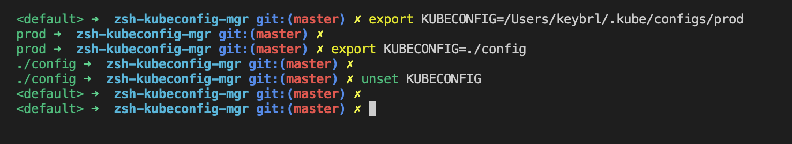
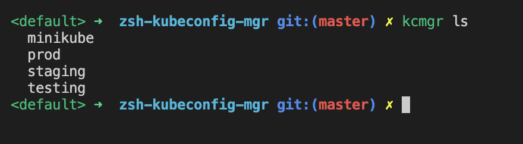
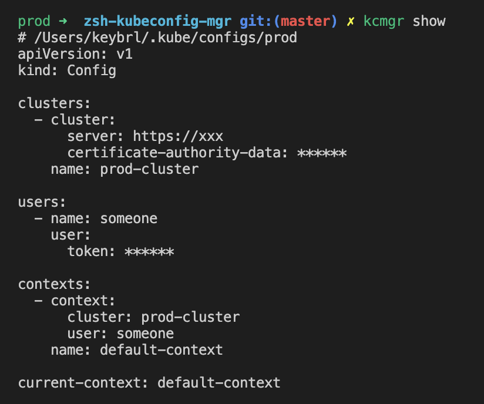
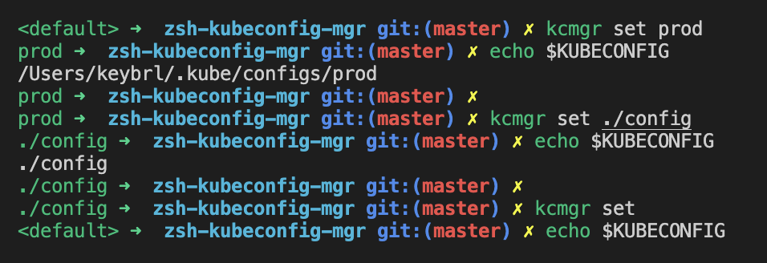
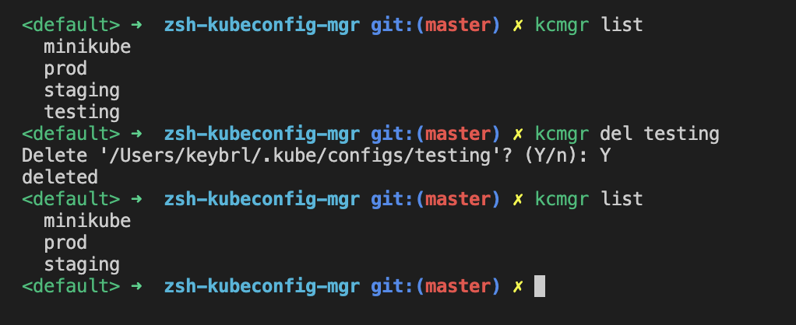

English | [简体中文](README_CN.md)

# zsh-kubeconfig-mgr

[](LICENSE)

> This project is a plugin for [Zsh](https://www.zsh.org/) and [oh-my-zsh](https://ohmyz.sh/), Designed to make managing and using multiple kubeconfig files easier.

In some cases, it may be necessary to operate multiple different [Kubernetes](https://kubernetes.io/) clusters, each with different credentials. And it might not be convenient to combine them into one kubeconfig file for various reasons. Therefore, when operating different clusters, you must frequently set the environment variable `$KUBECONFIG` to different values, or use the parameter `--kubeconfig /path/to/config ...` to specify different kubeconfig files when executing `kubectl`, these operations are very tedious and error-prone.

This project will provide an idea to solve these problems.

## Installation

### 1 Install Plugin

**Oh-my-zsh:**

If you have installed [oh-my-zsh](https://ohmyz.sh/), then:

1. Clone this repository in oh-my-zsh's plugins directory:
   ```sh
   git clone https://github.com/yhlooo/zsh-kubeconfig-mgr.git ${ZSH_CUSTOM:-~/.oh-my-zsh/custom}/plugins/zsh-kubeconfig-mgr
   ```
2. Activate the plugin in `~/.zshrc` :
   ```zsh
   plugins=( [plugins...] zsh-kubeconfig-mgr)
   ```
3. Restart zsh (such as by opening a new instance of your terminal emulator).

**Zsh:**

If you don't have oh-my-zsh installed, you can simply clone this repository and source the script:

```sh
git clone https://github.com/keybrl/zsh-kubeconfig-mgr.git
source ./zsh-kubeconfig-mgr/zsh-kubeconfig-mgr.zsh
echo "source ${(q-)PWD}/zsh-kubeconfig-mgr/zsh-kubeconfig-mgr.zsh" >> ${ZDOTDIR:-$HOME}/.zshrc
```

### 2 Set command line prompt

The plugin provides a command line prompt which can be added to the variable `PROMPT` or `RPROMPT` as you need

Simply add something like the following to the end of `~/.zshrc` :

```zsh
PROMPT='$(kubeconfig_prompt_info) '$PROMPT
```

## Usage

### Command line prompt

The function `kubeconfig_prompt_info` will print the kubeconfig specified by the current environment variable `$KUBECONFIG` . Its value has the following situations:

- `<default>` means `$KUBECONFIG` is empty, the active kubeconfig is  `~/.kube/config`
- `config` means `~/.kube/configs/config`
- `./path/to/config` indicates the relative path to kubeconfig
- `~/path/to/config` indicates the path of the kubeconfig relative to `$HOME`
- `/path/to/config` indicates the absolute path of kubeconfig

The printed color indicates whether the corresponding kubeconfig exists or not:

- Green: Exist
- Red: Not exist or not a file

Example:

Add the following to the end of `~/.zshrc` :

```zsh
PROMPT='$(kubeconfig_prompt_info) '$PROMPT
```

Effect:



### List kubeconfig

`kcmgr ls` , `kcmgr list` or `lkc` (**l**ist **k**ube**c**onfig)

list all filenames in the directory `~/.kube/configs/`



### Show the content of kubeconfig

`kcmgr show [config]` or `rkc [config]` (**r**ead **k**ube**c**onfig)

- `kcmgr show` Show the content of the currently effective kubeconfig
- `kcmgr show <config>` Show the content of the specified kubeconfig



### Set kubeconfig

`kcmgr set [config]` or `skc [config]` (**s**et **k**ube**c**onfig)

- `kcmgr set` equivalent to `unset KUBECONFIG`
- `kcmgr set <config>` set `$KUBECONFIG` to the specified kubeconfig



### Delete kubeconfig

`kcmgr delete [config]` , `kcmgr del [config]` or `dkc [config]` (**d**elete **k**ube**c**onfig)

- `kcmgr delete` Delete the currently effective kubeconfig
- `kcmgr delete <config>` Delete the specified kubeconfig



### Edit / Add kubeconfig

`kcmgr edit [config]` or `ekc [config]` (**e**dit **k**ube**c**onfig)

- `kcmgr edit` Edit the currently effective kubeconfig
- `kcmgr edit <config>` Edit the specified kubeconfig

Prefer `vim` , or `vi` if `vim` not found. If kubeconfig does not exist it will be created.


